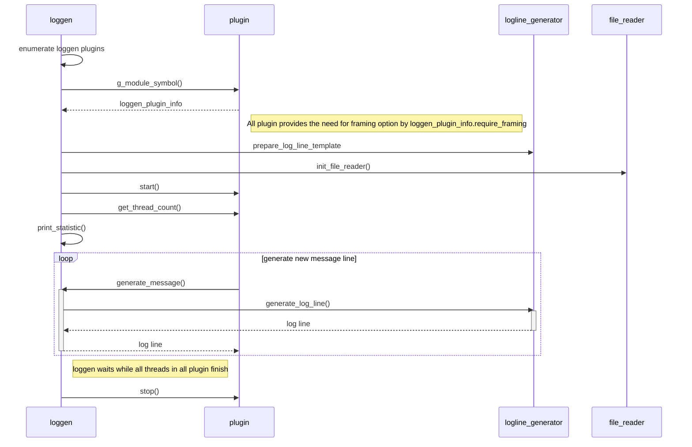

# Concept
loggen is a test tool to generate log messages for testing syslog-ng. 

# Technical details
loggen is designed to support plugins which allows to add any further log protocol/interface. 

## Main thread application
The main program (loggen binary) is the glue for the [plugins](##plugins) and provides common functions to them. It is responsible to discover the plugins, load and start them.

A common function -used by plugins- is the **log content generation**. You can select either [file reader](##file-reader) or log [line generator](##log-line-generator) by command line options.
> To send a log message towards syslog-ng is the responsibility of the [plugins](##plugins). Main thread application doesn't have any functions to do this.

### File reader
The file reader can be activated by command line argument --read-file. In this case loggen will read the file you specified in command line and plugins can read the content of the file line-by-line. File reader is able to parse the content of the file and is prepared to read it in a loop so you don't need to worry about number of log lines in your file.
All file reader options can bee query by
```
./loggen "--help-File reader"
```

### Log line generator
This unit is designed to generate dummy log messages in different format. The message part of the loglines are substituted by "PADDPADDPADD..." string.

> If you specify both file source and log line generator options at same time, loggen will use file source by default

## Plugins
A loggen plugin is a dynamic linked library (typically .so file) which shall implement a loggen_plugin_info struct including some mandatory functions.
```c
plugin_info loggen_plugin_info =
{
  .name = "my-plugin-name",
  .get_options_list = get_options,
  .start_plugin = start,
  .stop_plugin = stop,
  .get_thread_count = get_thread_count,
  .generate_message_func = generate_message,
  .require_framing = FALSE
};
```
When loggen main thread starts it looks for .so files in lib/syslog-ng/loggen folder. If an .so file contains the above *loggen_plugin_info* struct we suppose it is a valid loggen plugin.
The struct members has the following meaning:

 - name (gchar *): this is the name of your plugin. it is used only for debug messages
 - get_options_list: this is function pointer which shall point to a function returns the GOptionEntry ([see details](##command-line-options)) to display your plugin's command line options.
 - start_plugin: this function will be called when loggen wants to start your plugin. In this function you can spawn threads as well.
 - stop_plugin: this function will be called when loggen wants to stop your plugin.
 - get_thread_count: this function will be called by loggen to determine how many threads are still running in your plugin. If this function returns zero, loggen suppose your plugin finish it's job and will call stop function on it.
 - generate_message: this is a callback function to plugins. When a plugin needs a new log line it shall call this function and the main thread will provide the generated (or file read) log line content. See details at  [file reader](##file-reader) or log [line generator](##log-line-generator)
 - require_framing (gboolean): the plugin can indicates thet it requires framing option in log line generation process.

## Command line options
There are some common command line options which are defined by the main program. Those options are for either used by **all** plugins or needed for log content generation.
Other command line options are related to plugins only. All plugin is responsible to define it's own command line options. You have to define a GOptionEntry struct like this:
```c
static GOptionEntry loggen_options[] =
{
  { "inet", 'i', 0,   G_OPTION_ARG_NONE, &inet_socket_i, "Use IP-based transport (TCP, UDP)", NULL },
  { "unix", 'x', 0,   G_OPTION_ARG_NONE, &unix_socket_x, "Use UNIX domain socket transport", NULL },
  { "stream", 'S', 0, G_OPTION_ARG_NONE, &sock_type_s,   "Use stream socket (TCP and unix-stream)", NULL },
  { "ipv6", '6', 0,   G_OPTION_ARG_NONE, &use_ipv6,      "Use AF_INET6 sockets instead of AF_INET (can use both IPv4 & IPv6)", NULL },
  { "dgram", 'D', 0,  G_OPTION_ARG_NONE, &sock_type_d,   "Use datagram socket (UDP and unix-dgram)", NULL },
  { NULL }
};
```
The get_options_list() function shall return whit this struct and the main program will append your options to other plugins options.

> loggen will call start on every plugin in the folder. It is your plugin's responsibility to determine if it need to run or not. It can be determined by the command line options. If none of your plugin specific options activated it means your plugin shouldn't send any log.

To get all available command line option, you can use this command:
```
./loggen --help-all
```

## How loggen starts/stops?


