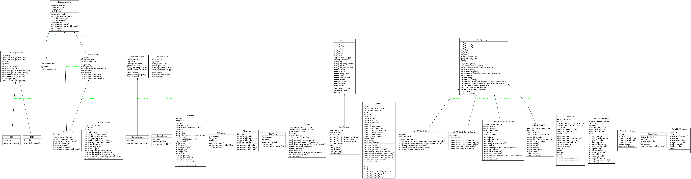

# The following page will describe how to use the functional test framework for syslog-ng.

## Requirements of the framework
* Software requirements:
  * installed syslog-ng (from package or from source)

* Package requirements:
  * required packages: python3, pytest, colorlog, psutil
  * optional packages: gdb, strace, valgrind, pytest-cov, pytest-mock, pytest-profiling, pytest-xdist, pytest-repeat

## How to start using the framework
### Command line options
* There are some command line options which can help to use the framework.

  * --installmode: define the installation mode of syslog-ng. The default value is: "custom", which means syslog-ng is installed on non standard place on a machine. Details of the setup is in [source/syslog_ng/path/path_database.py]
  * --installpath: If the installmode is "custom" you should define an alternative syslog-ng installation path, for example: /home/user/syslog-ng/install
  * --loglevel: Define the loglevel of testruns. Available loglevels: info, debug, error
  * --runslow: Also runs tests with @slow marks
  * --syslogngversion: Define syslog-ng version. It will be used in configuration.

* Get available command line options (in custom options section):
```
$ pytest --help
```

### Run self test for the framework:
```
$ python3 -m pytest source/ --installpath=[installpath for syslog-ng] --runslow --loglevel=debug -lvs
```

### Run functional tests for syslog-ng:
```
$ python3 -m pytest functional_tests/ --installpath=[installpath for syslog-ng] --runslow --loglevel=debug -lvs
```


## How the framework works:

### Special features of the framework
* The framework "archives" all session files from each testcase runs under the reports/ dir:
    * started parameters for the testrun
    * testcase log file
    * source/destination files,
    * syslog-ng configuration, pid, socket, persist,
    * syslog-ng core file, backtrace for the core
    * strace, perf, valgrind log files (if they was used)
    * original testcase file which was started


* If syslog-ng crashes during the testrun, and core file was generated the framework will detected it, and get backtrace information from the core file.

* A general syslog-ng functional testcase run takes only ~0.60 sec. It contains:
    * configuring syslog-ng
    * wait for syslog-ng starting with the given configuration
    * sending message to syslog-ng
    * waiting for messages in destination side
    * comparing expected with actual messages
    * stopping syslog-ng


* During the testcases syslog-ng can be run in client-server mode. Which means you can run syslog-ng with a client and a server configuration.
Exmaple can find at: `tests/functional_tests/source/syslog_ng/binaries/syslog_ng/selftest/test_syslog_ng_binary.py`

## Some pytest related features (with help of external pytest plugins):

* Get the 10 slowest test functions:
```
$ python3 -m pytest functional_tests/ --durations=10
```

* Run tests with profiler:
```
$ python3 -m pytest --profile functional_tests/test_examples/test_use_single_drivers.py
```

* Run coverage on the framework:
```
$ python3 -m pytest --cov source/ source/ --runslow --installpath=[path] --loglevel=debug
$ python3 -m coverage html -d [dirpath]
```

* Run selected test in number of times:
```
$ python3 -m pytest functional_tests/test_examples/test_use_single_drivers.py --count=10
```

* Enter a pdb on testcase failure
```
$ python3 -m pytest functional_tests/test_examples/test_use_single_drivers.py --pdb
```

* Stop test run on first failure:
```
$ python3 -m pytest functional_tests/test_examples/test_use_single_drivers.py -x
```

* Filter for testcase name:
```
$ python3 -m pytest functional_tests/ -k test_use_single_drivers_with_templated_destination
```

## Class diagramm of the framework

